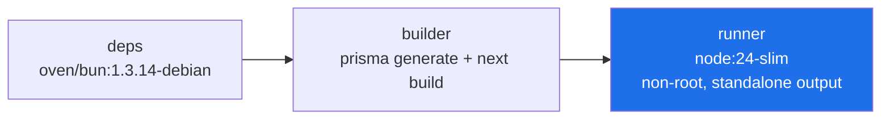
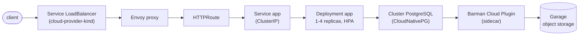
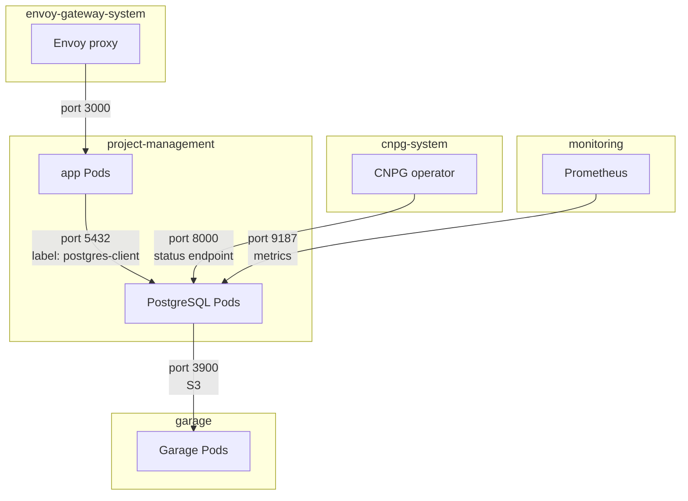
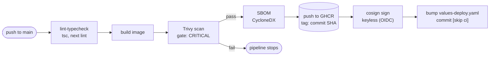
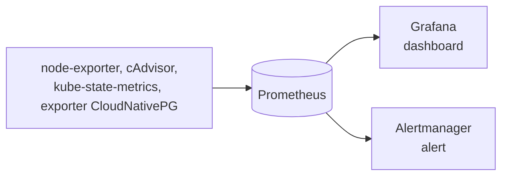

# Architecture

Aplikasi manajemen proyek (Next.js + Prisma + PostgreSQL) yang dijalankan di atas Kubernetes, dengan pipeline CI/CD dan observability. Dokumen ini menjelaskan bentuk teknis sistem apa adanya, bukan roadmap.

## Container Image

Multi-stage build (`Dockerfile`):

- `deps`: `oven/bun:1.3.14-debian`. Install dependency lewat bun (`bun install --frozen-lockfile`).
- `builder`: dari `deps`, copy source, generate Prisma client, `next build` dengan output standalone.
- `runner`: `node:24-slim`. Copy hasil build standalone dari `builder`. Jalan sebagai user non-root. `openssl` di-install eksplisit karena query engine Prisma butuh libssl yang tidak tersedia di base image slim secara default. `npm`/`npx`/`corepack` bawaan base image dihapus karena tidak pernah dipakai (package manager aplikasi ini bun, entrypoint runtime `node server.js`).

Build pakai bun, runtime pakai Node. Menjalankan Next.js produksi di atas bun bukan jalur yang didukung resmi, jadi dua tahap ini memakai base image berbeda.

## Kubernetes Cluster

Cluster kind satu node (control-plane merangkap worker), CNI kindnet yang menegakkan `NetworkPolicy`.

Komponen platform, di-install langsung dari sumber resmi:

- cert-manager, prasyarat plugin backup CloudNativePG.
- cloud-provider-kind, proses Docker terpisah di luar Kubernetes yang memberi alamat IP ke Service `type: LoadBalancer`.
- CloudNativePG operator, menjalankan `Cluster` PostgreSQL satu instance dengan WAL archiving lewat Barman Cloud Plugin.
- Envoy Gateway, implementasi Gateway API yang melayani `Gateway`/`HTTPRoute`.
- metrics-server, sumber metrik untuk `kubectl top` dan HorizontalPodAutoscaler.

Objek yang ditulis sendiri di repo, dikelompokkan per namespace:

| Namespace | Pod Security | Isi |
| :--- | :--- | :--- |
| `garage` | restricted | `StatefulSet` Garage (object storage S3-compatible), satu replika, bootstrap layout/bucket/access key dari environment variable saat start |
| `project-management` | restricted | `Cluster` PostgreSQL, `ObjectStore`, Job migrasi + seed (Helm hook), `Deployment`/`Service` aplikasi, `Gateway`/`HTTPRoute`, `HorizontalPodAutoscaler`, `Backup`/`ScheduledBackup` |
| `monitoring` | privileged | Prometheus, Alertmanager, Grafana, kube-state-metrics, node-exporter (rilis Helm `kube-prometheus-stack`) |

Namespace `monitoring` privileged karena node-exporter butuh `hostNetwork`, `hostPID`, dan hostPath volume untuk membaca metrik node lewat `/proc`/`/sys`, kebutuhan yang dilarang bahkan oleh kebijakan `baseline`.

Seluruh workload aplikasi memakai `securityContext` profil restricted dengan `readOnlyRootFilesystem: true`.

## Helm Releases

Database dan aplikasi dipasang sebagai dua rilis Helm terpisah, bukan satu:

- `charts/database`: `ObjectStore`, `Cluster` (anotasi `helm.sh/resource-policy: keep`), `ScheduledBackup`, `PodMonitor` (dijaga lewat pengecekan kapabilitas Helm, lihat [DECISION.md](DECISION.md)), `NetworkPolicy` sisi database.
- `charts/app`: `Deployment`, `Service`, `Gateway`, `HTTPRoute`, `HorizontalPodAutoscaler`, `NetworkPolicy` aplikasi. Migrasi Prisma berjalan sebagai hook `pre-install`/`pre-upgrade`, seed data sebagai hook `post-install`/`post-upgrade`.

Pemisahan ini membuat `helm uninstall` pada rilis aplikasi tidak menyentuh database maupun PersistentVolumeClaim-nya.

`GatewayClass` dan komponen platform lain di luar kedua chart, sebagai manifest cluster-scoped yang dipakai bersama, bukan milik satu rilis.

Alamat API server yang dibutuhkan `NetworkPolicy` egress dibaca dari cluster saat pemasangan (lewat `EndpointSlice` Service `kubernetes`), bukan ditulis statis di file konfigurasi, karena alamat ini berbeda tiap lingkungan.

## Traffic Path

## Network

Tiap namespace ditutup dengan `NetworkPolicy` default-deny (ingress dan egress), lalu dibuka selektif seperti digambarkan di atas, plus DNS ke CoreDNS untuk seluruh Pod.

Aturan yang menyeleksi Pod PostgreSQL memakai keberadaan label cluster CloudNativePG, bukan nilai spesifiknya. Alasannya ada di [DECISION.md](DECISION.md).

Penegakan egress lintas namespace di CNI kind ini tidak seragam: trafik dalam namespace terbukti tertegakkan, sementara beberapa tujuan di luar namespace tetap terjangkau meski aturan deny aktif. Detail dan status kontrol keamanan yang berlaku ada di [SECURITY.md](SECURITY.md).

## CI/CD

GitHub Actions, dua job: `lint-typecheck` berjalan di setiap push dan pull request; `build-scan-push` berjalan hanya pada push ke branch utama setelah `lint-typecheck` lolos. Image yang gagal gate Trivy tidak pernah sampai ke registry.

Rilis aplikasi disinkronkan ke cluster lewat Argo CD (GitOps), bukan `helm upgrade` manual, memakai commit bump di atas sebagai pemicu. Detail alur CI/CD lengkap ada di [DEVELOPMENT.md](DEVELOPMENT.md).

## Observability

`kube-prometheus-stack` (Prometheus, Grafana, Alertmanager) mengumpulkan metrik node, container, dan database. Detail lengkap ada di [MONITORING.md](MONITORING.md).

## Reproducibility

Seluruh orkestrasi di atas bisa dibangun ulang dari cluster kosong lewat sekumpulan script berurutan (lihat struktur folder di [README.md](README.md)): pembuatan cluster, instalasi komponen platform, instalasi object storage, instalasi database dan aplikasi, instalasi observability, lalu serangkaian pemeriksaan otomatis (kesehatan Pod, penegakan Pod Security, jalur HTTP lewat Gateway, isi data, penegakan NetworkPolicy lewat uji positif dan negatif, keberhasilan WAL archiving dan backup, scrape target Prometheus, ketersediaan dashboard Grafana, alert yang bisa dipicu, lonjakan koneksi database yang terbukti lewat metrik nyata) dan uji restore backup penuh (membuat database baru dari backup, membandingkan isinya dengan sumber).

Image PostgreSQL dan image aplikasi ditarik/dibangun di host lalu dimuat langsung ke node cluster, bukan dibiarkan ditarik oleh kubelet saat runtime.
