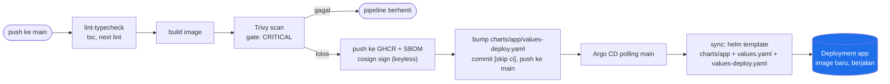

# Development

Jalur dari commit ke Pod yang berjalan di cluster: continuous integration lewat GitHub Actions, continuous deployment lewat Argo CD (GitOps). Dokumen ini menjelaskan pipeline apa adanya, bukan roadmap.

## Overview



Tidak ada `kubectl apply` atau `helm upgrade` manual di jalur ini. Satu-satunya aksi manusia adalah `git push` ke `main`.

## CI (GitHub Actions)

Dua job di `.github/workflows/ci.yml`:

- **`lint-typecheck`**, jalan di tiap push dan pull request: `tsc --noEmit`, `next lint`.
- **`build-scan-push`**, jalan hanya pada push ke `main` setelah `lint-typecheck` lolos:
  1. Build image lewat `docker/build-push-action`.
  2. Scan Trivy, gate pada temuan `CRITICAL` yang punya perbaikan tersedia. Gagal di sini berarti image tidak pernah sampai ke registry.
  3. Generate SBOM (CycloneDX), diunggah sebagai artifact build.
  4. Push image ke GHCR, tag = commit SHA.
  5. Ambil digest image dari registry, sign dengan cosign keyless (identitas OIDC GitHub Actions, tanpa key material yang disimpan manual).
  6. Bump `charts/app/values-deploy.yaml` (`image.tag`, `image.digest`) ke nilai yang baru saja di-push, commit dengan pesan memuat `[skip ci]` supaya commit ini sendiri tidak memicu run baru, lalu push ke `main`. Push dicoba ulang (dengan `pull --rebase`) sampai 5 kali kalau `main` sudah bergerak di antara checkout dan push.

## CD (Argo CD)

Argo CD berjalan dalam mode Core (tanpa API server/UI web), diinstal dari `core-install.yaml` resmi. Interaksi lewat `argocd --core` atau `kubectl` langsung terhadap resource `Application`. AppProject `default`, yang biasanya dibuat otomatis oleh API server saat start, diterapkan manual sebagai bagian provisioning karena Core mode tidak menjalankan API server.

Satu `Application`, single-source:

| Field | Nilai |
| :--- | :--- |
| `repoURL` | `git@github.com:qrizan/project-management.git` (SSH, deploy key read-only khusus repo ini) |
| `path` | `charts/app` |
| `targetRevision` | `main` |
| `helm.valueFiles` | `values.yaml`, `values-deploy.yaml` |
| `helm.releaseName` | `app` |
| `syncPolicy.automated` | `prune: true`, `selfHeal: true` |

Chart dan values berada di repo yang sama, dibaca lewat satu source. Alasan desain single-source ada di [DECISION.md](DECISION.md).

**Cakupan sync terbatas ke `charts/app`.** `charts/database` tetap dipasang sebagai rilis Helm langsung (bukan lewat Argo CD) karena siklus hidupnya berbeda: `Cluster` PostgreSQL dan volume datanya tidak boleh ikut ter-reconcile oleh perubahan pada rilis aplikasi.

`selfHeal: true` berarti perubahan manual apa pun terhadap objek yang dikelola rilis `app` (`kubectl edit`, `kubectl patch`, dan semacamnya) dikembalikan otomatis ke apa yang tertulis di git, dalam hitungan detik sampai menit tergantung interval polling.

## Credentials

Dua kredensial terlibat di jalur ini, keduanya dibuat di luar repo dan disuntik ke cluster sebagai Kubernetes Secret saat provisioning, tidak pernah masuk version control:

- **Deploy key SSH, read-only**, khusus repo `project-management`. Dipakai `argocd-repo-server` untuk membaca chart dan values lewat git.
- **Personal access token GitHub, scope `read:packages`**. Dipakai sebagai `imagePullSecret` supaya node cluster bisa menarik image aplikasi dari GHCR, yang ikut privat mengikuti visibilitas repo sumbernya.

## Known Limitation

`scripts/reproduce/run-all.sh` tanpa flag `--clean` (membangun di atas cluster yang sudah ada) tidak didukung begitu Argo CD pernah terpasang di cluster itu. Script provisioning lain (`40-app.sh`, `45-helm-lifecycle.sh`) mengubah rilis Helm `app` langsung lewat CLI; kalau dijalankan terhadap cluster yang Argo CD-nya sudah aktif, keduanya akan berebut objek yang sama dengan `selfHeal`. Belum ada mekanisme yang mencegah ini secara otomatis. Satu-satunya jalur yang diverifikasi dan didukung adalah `run-all.sh --clean` dari cluster kosong.

## Verifying

```
scripts/reproduce/run-all.sh --clean
```

Membangun ulang seluruh stack dari nol, termasuk Argo CD, dan memverifikasi: image Pod aplikasi berasal dari GHCR (bukan build lokal), status `Application` `Synced` + `Healthy`, dan `selfHeal` benar-benar mengembalikan drift yang dibuat manual. Terverifikasi lolos ujung ke ujung 2026-08-20.
