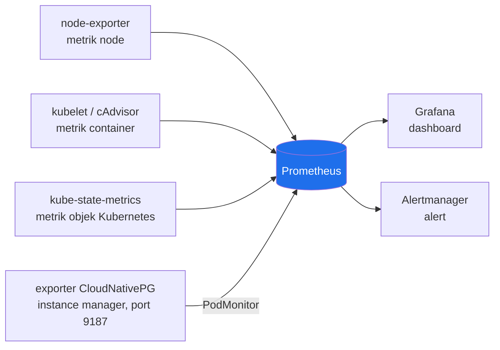
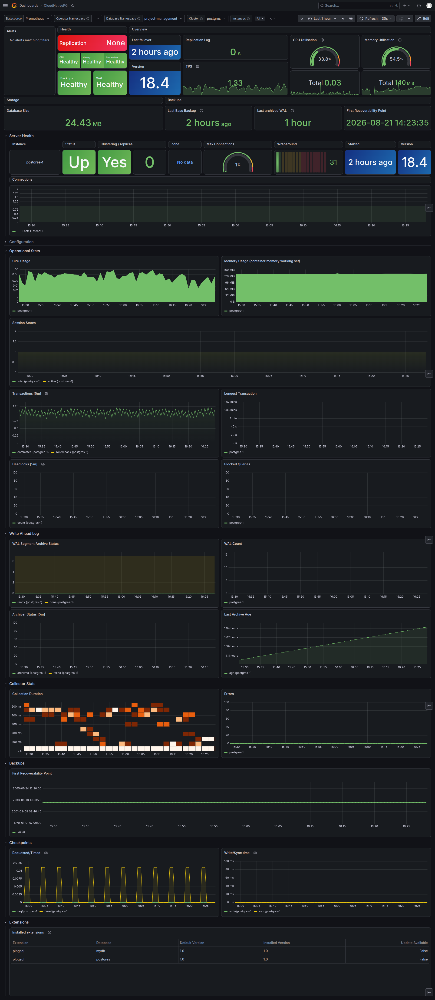

# Monitoring

Prometheus, Grafana, dan Alertmanager (`kube-prometheus-stack`) mengumpulkan metrik node, container, dan database, lalu menampilkannya lewat dashboard dan alert. Dokumen ini menjelaskan apa yang dipantau dan bagaimana mengaksesnya, bukan roadmap.

## Overview



Metodologi yang dipakai: **USE** (Utilization, Saturation, Errors), diterapkan ke tiga resource yang benar-benar ada di sistem ini: node, container/Pod, dan database. Metrik level aplikasi (request rate, latency per endpoint) tidak dikumpulkan, karena butuh instrumentasi tambahan di kode aplikasi, di luar cakupan kerja saat ini.

## What's Monitored

| Resource                 | Sumber metrik                                                   | Cakupan                                                                             |
| :----------------------- | :-------------------------------------------------------------- | :---------------------------------------------------------------------------------- |
| Node                     | `prometheus-node-exporter`                                    | CPU, memory, disk, network host                                                     |
| Container / Pod          | cAdvisor (lewat kubelet) +`kube-state-metrics`                | CPU, memory, restart count, status Pod, mencakup namespace aplikasi maupun database |
| Database (CloudNativePG) | Exporter bawaan instance manager, di-scrape lewat`PodMonitor` | Koneksi, ukuran database, replikasi, checkpoint, WAL, konfigurasi Postgres          |

Exporter CloudNativePG tidak menambah container baru pada Pod database, karena sudah terintegrasi ke proses instance manager sejak awal.

## Dashboards

Dua kelompok dashboard di Grafana:

- **Bawaan `kube-prometheus-stack`**: "Kubernetes / Compute Resources / Cluster" dan "Node Exporter / Nodes", untuk CPU/memory/network per namespace dan per node.
- **CloudNativePG**, disunting dari dashboard resmi proyek CNPG (`cloudnative-pg/grafana-dashboards`). 32 panel dari versi upstream dibuang karena metriknya struktural tidak akan pernah terisi di cluster ini (butuh standby yang benar-benar terhubung, fitur CSI yang tidak diimplementasikan, atau metrik operator yang tidak ter-scrape), sehingga isinya cuma menampilkan panel yang benar-benar punya data. Detail dan alasan tiap panel yang dibuang ada di [DECISION.md](DECISION.md).



Dari atas ke bawah: status alert dan kesehatan cluster (replikasi, backup, WAL), ringkasan versi/koneksi/utilisasi CPU-memory, tabel kesehatan instance (status, jumlah koneksi, wraparound), section Configuration (parameter Postgres seperti `shared_buffers`/`work_mem`, satu-satunya bagian yang `collapsed`/tersembunyi secara default), lalu statistik operasional (CPU/memory container, transaksi, deadlock), Write Ahead Log, statistik exporter, backup, checkpoint, dan extension Postgres yang terpasang, seluruhnya tampil langsung tanpa perlu diklik.

Indikator "Replication None" berwarna merah di kiri atas bukan tanda gangguan. Cluster ini sengaja satu instance tanpa replika (lihat [DECISION.md](DECISION.md)), jadi panel yang mengukur ketersediaan replika untuk failover memang selalu melaporkan "None".

## Alerting

Rule bawaan `kube-prometheus-stack` aktif untuk node dan container (grup `node-exporter`, `kubernetes-resources`, `kubernetes-system`, `kube-state-metrics`, dan sejenisnya). Empat grup terkait control plane (`kubeScheduler`, `kubeControllerManager`, `kubeEtcd`, `kubeProxy`) dimatikan karena kind menjalankan komponen itu di luar Pod, sehingga endpoint metriknya tidak ada.

Satu rule custom, `AppPodRestartingDemo` (`for: 30s`), dipakai membuktikan jalur alerting benar-benar berfungsi lewat `scripts/reproduce/48-alert-drill.sh`.

**Tidak ada rule untuk metrik CloudNativePG.** Ini sudah diperiksa lewat drill lebih jauh, lihat [Known Limitations](SECURITY.md#known-limitations).

## Fault Injection

Manifest yang terpasang tidak otomatis berarti sistemnya mendeteksi masalah nyata. Dua kondisi diuji dengan memicu kegagalan sungguhan lalu membuktikan lewat data, bukan cuma lewat keberadaan manifest:

- **Connection exhaustion CloudNativePG** (`scripts/reproduce/49-connection-drill.sh`): membuka 70 koneksi paralel ke database, membuktikan metrik `cnpg_backends_total` naik mengikuti kondisi nyata.
- **`OOMKilled` (retroaktif)**: query terhadap insiden `OOMKilled` nyata yang pernah terjadi pada sebuah Pod observability. Hasilnya: **tidak ada rule alert bawaan yang firing** saat insiden itu terjadi, dicatat sebagai temuan di [Known Limitations](SECURITY.md#known-limitations).

## Access

Prometheus, Grafana, dan Alertmanager tidak diekspos lewat Gateway, diakses lewat `kubectl port-forward` ke namespace `monitoring`.

Kredensial admin Grafana dibuat otomatis oleh chart saat provisioning, dibaca dari Secret:

```
kubectl get secret grafana-admin -n monitoring -o jsonpath='{.data.admin-user}' | base64 -d; echo
kubectl get secret grafana-admin -n monitoring -o jsonpath='{.data.admin-password}' | base64 -d; echo
```

Prometheus dan Alertmanager tidak punya autentikasi (bawaan chart, tanpa basic auth tambahan).

| Komponen     | Port-forward                                                                             | Port asli           |
| :----------- | :--------------------------------------------------------------------------------------- | :------------------ |
| Grafana      | `kubectl port-forward -n monitoring svc/kube-prometheus-stack-grafana 19300:80`        | 80 (container 3000) |
| Prometheus   | `kubectl port-forward -n monitoring svc/kube-prometheus-stack-prometheus 19090:9090`   | 9090                |
| Alertmanager | `kubectl port-forward -n monitoring svc/kube-prometheus-stack-alertmanager 19093:9093` | 9093                |

Port lokal (`19090`, `19300`, `19093`) dipilih supaya tidak bentrok dengan port 3000 yang dipakai dev server aplikasi sendiri. `scripts/reproduce/48-alert-drill.sh`, `49-connection-drill.sh`, dan `50-verify.sh` memakai port yang sama untuk pemeriksaan otomatis.

## Verifying

```
scripts/reproduce/run-all.sh --clean
```

Mencakup pemeriksaan otomatis (`50-verify.sh`): scrape target aplikasi dan database, dashboard tersedia lewat API Grafana, ditambah dua drill di atas. Detail lengkap reproduksi ada di [README.md](README.md).
